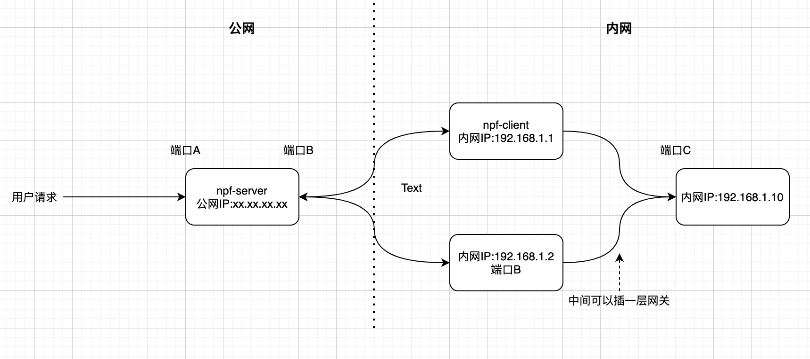

### 概要

npf (net port forward) 是一套简易的 <b>网络端口转发</b> 工具服务包（不包含心跳服务），其中包含了服务端（npf-server）和客户端（npf-client）两大模块。

### 使用前提
必须要有一台拥有公网IP的服务器，且至少有两个非通用端口开放在公网上。

### 使用场景

主要用于代理网络请求，实现通过公网可以访问内网服务的功能（即内网穿透）。比如你想本地调试自己在 <b>XX开放平台</b> 上设置的回调接口，这时候就可以通过这套服务，将你的接口暴露在公网上，从而解决调试问题。

### 使用说明

- 更改源码设置IP、端口：server需要设置接收公网请求的端口和接收内网客户端请求的端口，客户端需要设置服务端的IP和端口、内网业务服务的IP和端口

- 将server服务部署在公网IP的服务器，

- 将client服务部署在内网机器上，理论上可以部署多台。

- 访问公网端口A，请求会路由到C

### 架构图
